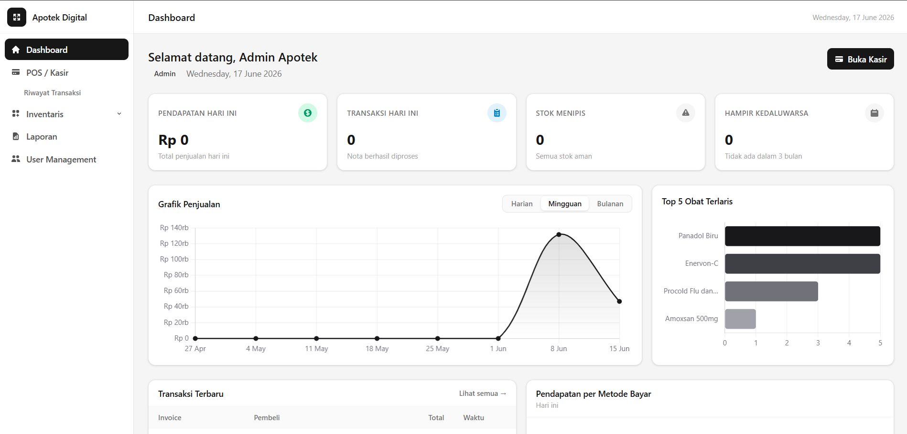

#  Apotek Digital

> Sistem manajemen apotek modern berbasis web — mengelola inventaris obat, transaksi penjualan dengan atau tanpa resep dokter, pemantauan kedaluwarsa, dan integrasi BPJS.


---

##  Preview

> 

---

##  Fitur

- **POS / Kasir** — Transaksi penjualan multi-item, validasi resep otomatis, multi-metode pembayaran (Cash, Transfer, BPJS, Asuransi), cetak struk PDF
- **Manajemen Inventaris** — CRUD data obat, kategori berbasis ATC WHO, stok opname, riwayat mutasi stok, logika FEFO (First Expired First Out)
- **Dashboard & Analitik** — KPI real-time, grafik penjualan, alert stok menipis & obat hampir kedaluwarsa, Top 5 obat terlaku
- **Integrasi BPJS** — Verifikasi status peserta, restriksi Formularium Nasional (Fornas), alur klaim BPJS(Belum terintegrasi dengan API dari Badan Kesehatan)
- **Manajemen User** — Role-based access control (Admin, Apoteker, Kasir)
- **Landing Page** — Halaman publik berbasis React.js

---

##  Tech Stack

| Layer | Teknologi |
|---|---|
| Frontend Publik | React.js + Tailwind CSS |
| Frontend Internal | Laravel Blade + Livewire v4 |
| Backend | Laravel 13 |
| Database | MariaDB 11.8.6 |
| PDF Generation | barryvdh/laravel-dompdf |

---

##  Halaman

| URL | Akses | Keterangan |
|---|---|---|
| `/` | Publik | Landing page |
| `/login` | Publik | Halaman login |
| `/sistem/dashboard` | Admin, Apoteker | Dashboard & analitik |
| `/sistem/pos` | Semua role | Kasir / POS |
| `/sistem/pos/riwayat` | Semua role | Riwayat transaksi |
| `/sistem/inventaris/obat` | Admin, Apoteker | Daftar & kelola obat |
| `/sistem/inventaris/kategori` | Admin, Apoteker | Manajemen kategori |
| `/sistem/inventaris/stok-opname` | Admin, Apoteker | Stok opname |
| `/sistem/inventaris/mutasi` | Admin, Apoteker | Riwayat mutasi stok |
| `/sistem/admin/users` | Admin | Manajemen user |

---

##  Database

| Tabel | Fungsi |
|---|---|
| `users` | Autentikasi dan role (admin, pharmacist, cashier) |
| `categories` | Kategori obat berbasis ATC WHO |
| `medicines` | Master data obat |
| `medicine_batches` | Tracking batch per restock (FEFO) |
| `suppliers` | Data pemasok |
| `purchase_orders` | Pembelian / restock dari supplier |
| `stock_mutations` | Riwayat keluar-masuk stok |
| `sales` | Header transaksi penjualan |
| `sale_items` | Detail item per transaksi |

---

##  Struktur Project

```
apotek-digital/
├── app/
│   ├── Contracts/          # Interface (BpjsServiceInterface)
│   ├── Http/Middleware/    # EnsureAuthenticated, RoleMiddleware
│   ├── Livewire/
│   │   ├── Admin/          # UserManagement
│   │   ├── Dashboard/      # KpiPanel, SalesChart
│   │   ├── Inventaris/     # MedicineIndex, MedicineForm, StokOpname, dll.
│   │   └── Pos/            # KasirPage, RiwayatTransaksi
│   ├── Models/             # Medicine, Sale, SaleItem, Category, dll.
│   └── Services/           # PosService, DashboardService, MockBpjsService
├── database/
│   ├── factories/
│   ├── migrations/
│   └── seeders/
├── resources/views/
│   ├── livewire/           # Semua view Livewire
│   ├── pdf/                # Template struk PDF
│   └── sistem/             # Layout dan halaman utama
├── tests/
    ├── Feature/
    └── Unit/
```

---

##  Catatan

- Integrasi BPJS menggunakan **mock/simulasi** — bukan API resmi BPJS Kesehatan
- Project ini dibuat untuk keperluan **tugas akademik**